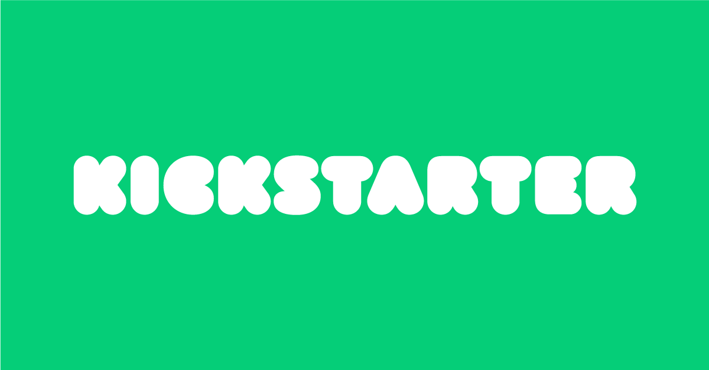

```{r setup, include=FALSE}
knitr::opts_chunk$set(echo = TRUE)
library(tidyverse)
library(DT)
library(scales)
```

## What is Kickstarter?
<p></p>
<p>Kickstarter is a funding platform for creative projects. Everything from film, games, and music to art, design, and technology. Kickstarter is full of ambitious, innovative, and imaginative projects that are brought to life through the direct support of others.
</p>
<p>Every project creator sets their project's funding goal and deadline. If people like the project, they can pledge money to make it happen. If the project succeeds in reaching its funding goal, all backers' credit cards are charged when time expires. Funding on Kickstarter is all-or-nothing. If the project falls short of its funding goal, no one is charged.</p>
 
<p>If a project is successfully funded, Kickstarter applies a 5% fee to the funds collected.</p>
## 1. Description of Kickstarters Dataset
```{r}
#Read in the data
kickstarter <- read.csv("datasets/ks-projects-201801.csv")
# Print out the head
datatable(head(kickstarter),fillContainer = TRUE)
# View the structure of the dataset
glimpse(kickstarter)
```

<p>A data frame with 378,661 observations on 15 variables</p>

## 2. Data Munging 
### Handeling the missing values
<p>Let's check first the N/As values</p>
```{r}
sum(is.na(kickstarter))
```

```{r}
# Check for N/As
library(reshape2)
kick_na <- data.frame(map_df(kickstarter,function(x) sum(is.na(x))))
kick_na
```
<p>N/A values exists only in one coulmn which is <i>usd.pledged</i>. However, we won't be using this column for our analysis since we have the <i>usd_pledged_real</i> coulmn instead. Therefore our next step will be drop the column with missing valu from the data frame.</p>
```{r results='hide'}
kickstarter <- select(kickstarter,-'usd.pledged')
```
### Dates Formatting
<p>Two dates columns <i>deadline</i> and <i>launched</i> in this data set are formatted as a character data type. Now, we are going to convert them to a Date data type so, we can handel them appropriately as dates in the analysis.</p>
```{r}
kickstarter$deadline <- as.Date(kickstarter$deadline)
kickstarter$launched <- as.Date(kickstarter$launched)
```

## 2. Exploratory Data Analysis 
<p>Let's check the status of Kickstarters projects</p>
#### Question 1: How many sucessful projects in general?
```{r}
kickstarter_status <- kickstarter %>% group_by(state) %>% 
                                      summarise(No_Of_Projects=n(),Percent_State=percent(No_Of_Projects/nrow(kickstarter),accuracy =0.01)) %>%
                                      arrange(desc(No_Of_Projects))
datatable(kickstarter_status)
```

```{r}
ggplot(kickstarter_status,aes(x=state,y=No_Of_Projects,label=No_Of_Projects)) +
   geom_bar( fill="lightgreen",stat='identity')+
   geom_text(size = 3, position = position_stack(vjust = 0.5))+
    labs( x = 'State of Projects', y = 'No Of Projects')+
  ggtitle('The number of the projects based on the state')
  
```

As we can see above that `r kickstarter_status$Percent_State[kickstarter_status$state=='successful']` of the projects were successful. However, `r kickstarter_status$Percent_State[kickstarter_status$state=='failed']` of the projects were failed. `r kickstarter_status$Percent_State[kickstarter_status$state=='canceled']` of the projects were canceled for unknown reasons. `r kickstarter_status$Percent_State[kickstarter_status$state=='suspended']` of the projects were suspended and `r kickstarter_status$Percent_State[kickstarter_status$state=='undefined']` marked as undefined. In addition, a small percentage of projects were still live at the time of data collection (`r kickstarter_status$Percent_State[kickstarter_status$state=='live']`).

As the uncompleted projects are representing a small part of the dataset, we will exclude them from our analysis. So, we will focus on the completed projects i.e. successful and failed which represent `r kickstarter_status$No_Of_Projects[kickstarter_status$state=='successful']+kickstarter_status$No_Of_Projects[kickstarter_status$state=='failed']` projects.

```{r}
complete_pro <- kickstarter %>%
              filter(state=='successful' | state=='failed')
```


#### Question 2: How many projects for each category? and what is the top projects categories?
```{r}
kickstarter_cat <- complete_pro %>% group_by(main_category,state) %>% 
                                      summarise(No_Of_Projects=n()) %>%
                                      arrange(desc(No_Of_Projects))
datatable(kickstarter_cat)
```

```{r}
ggplot(kickstarter_cat,aes(x=main_category,y=No_Of_Projects,label=No_Of_Projects,group=state,fill=state)) +
   geom_bar(stat='identity')+
   geom_text(size = 3, position = position_stack(vjust = 0.5))+
    labs( x = 'Main Category of Project', y = 'No Of Projects')+
  theme(axis.text.x = element_text(angle = 90))+
  ggtitle('The number of the projects based on the category')
  
```
From the plot above we can see that the top three categories are:
- Film & Video
- Music
- Publishing
#### Question 3: How many projects per countries?
```{r}
datatable(complete_pro %>% group_by(country) %>% 
                  summarise(No_Of_Projects=n(),Percent_Con=percent(No_Of_Projects/nrow(complete_pro))) %>%
                  arrange(desc(No_Of_Projects)))
#datatable(kickstarter_cat)                 
```

Most of the project were conducted in United states.

#### Question 4: How many projects per year?
```{r}
complete_pro %>% group_by(launched_year=format(launched, "%Y")) %>% 
                  summarise(No_Of_Projects=n()) %>% 
ggplot(.,aes(x=launched_year,y=No_Of_Projects)) +
   geom_bar(stat='identity')+
    labs( x = 'Year', y = 'No Of Projects')+
  ggtitle('The number of the projects per year')
```
From plot above, most projects have been launched in 2015.

#### Question 5: What is effecting the success of project?
Let's see if the project duration can impact the success of kickstarters projects

```{r}
complete_pro <- complete_pro %>% mutate(duration=deadline-launched)
state_duration <- complete_pro %>% group_by(duration,state) %>% summarise(No_Successful_Pro=n())
#ggplot(state_duration,aes(x=duration,y=No_Successful_Pro))+
#  geom_point()
state_duration %>% filter(state=='successful') %>% 
  ggplot(.,aes(x=duration,y=No_Successful_Pro))+
    geom_line()
```
From plot above, we can see that most of the successful  projects  take 25 - 35 days. 

Since Kickstarter projects are supported by backers, success of projects and amount pledged depend on number of backers. So, let's see the relationship between the amount pledged and number of backers

```{r}
ggplot(complete_pro,aes(x=usd_pledged_real,y=backers))+
  geom_point()+
  stat_smooth(method='lm',se=FALSE)
```
The plot above shows a relationship between the the amount pledged and number of backers and it satisfy the assumption of linear regression model.
```{r}
kickstarterlm <- lm(usd_pledged_real~backers,data=complete_pro)
summary(kickstarterlm)
```

As we can see the p value is <0.05 which means number of backers significantly affects pledged amount. So, a project which is able to attract higher numbers of backers is going to get more money raised.